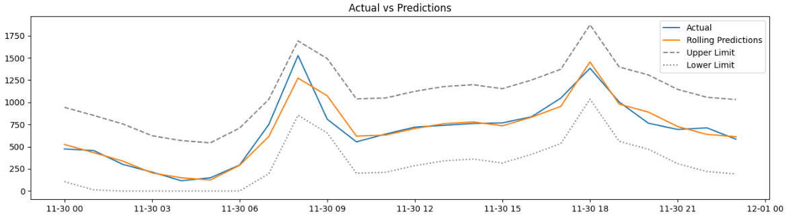

# Bike Rental Demand Forecasting  
A tool to forecast hourly bike demands for renting based on weather conditions and other parameters  
## Dataset Description
The bike rental demand data is hourly data and we have data for 1 year from 01-12-2017-00:00:00 to 30-11-2018-11:00:00. The Dataset contains the following columns:  
- Date: Date
- Rented Bike Count: Number of bikes rented  
- Hour: 0 to 23 hours
- Temparature: In Celsius
- Humidity: In percentages
- Wind Speed: In meter/seconds
- Visibility: Within 10 meters
- Dew Point Temparature: In Celsius
- Solar Radiation: In MJ/m2
- Rainfall: In mm
- Snowfall: In cm
- Seasons: Winter,Summer,Autumn,Spring
- Holiday: No Holiday or Holiday
- Functioning Day: Yes or No
### Tools  
|         Name         |                              Tool                              |
| :------------------: | :------------------------------------------------------------: |
|     **Language**     |                             Python                             |
|  **Web Framework**   |                            FastAPI                             |
| **Containerization** |                             Docker                             |
|    **Libraries**     | Numpy, Pandas, Matplotlib, Statsmodels, Scikit-Learn, Pmdarima |

## Analysis and Forecasting
1. Data Preprocessing
   - Checked for missing values
   - Converted 'Date' column to datetime
   - Added 'Hour' to 'Date' column
   - Converted the 'Date' column to Index
   - Converted 'Seasons','Holiday','Functioning Day' to categorical columns
      - 'Seasons' is one-hot-encoded
      - 'Holiday' and 'Functioning Day' is binary-encoded
   - Renamed the columns for ease of use 
2. Plotted the data
   - There is clear seasonality each 24 hours.
3. Augmented Dickey-Fuller Test is performed by taking first-difference of rented bike count and the data was stationary.
4. ACF and PACF plots are created and AR of order 2 and MA of order 3 had significant correlations.
5. Train-Test split is done. Validation data was chosen as the last 24 hour data.
6. Feature scaling is performed for the continuous variables. Min-Max Scaling is used.
7. Auto-ARIMA is run to identify best ARIMA order with lowest AIC score.
8. The model with lowest AIC score had SARIMA orders (1,1,0)(1,0,0,24)
9. A SARIMA model is fit without the exogenous features. The performace was not good. Validation MAPE was 26.43%, RMSE was 138.72 units.
10. A SARIMAX model is fit including all the exogenous features. The model improved partially. Validation MAPE became 17.9%, RMSE was 165.35 units.
11. Started to find a subset of exogenous features which are important. Used Variance Inflation Factor (VIF) to find multicollinear features. Removed features which were multicollinear to keep VIF of remaining features under 5. The model improved. Validation MAPE became 18.58%, RMSE became 129.95 units. 
12. The summary of the model showed 'Rain' and 'Snow' had very high p-values(0.661, 0.555 respectively). Removed these 2 features and refit the model again. Validation MAPE became 18.61% and RMSE became 129.89 units. Still not good. 
13. To improve the model we need to select good features. As Lasso performs model selection, multiple linear regression models were fit with the exogenous variables using Lasso for different alpha values(0.1,0.5,1,3,5,10,20,50). It was found that for alpha=20, the validation R-squared was highest at 0.17. The selected features were temparature, humidity, visibility, functioning day, season_winter.
14. Fitted SARIMAX model with the selected features from Lasso and validation MAPE became 14.35% and RMSE became 92.34 units. The model improved.
15. Removed season_winter as p-value was very high(0.972) and refit model. Validation metrics remained same. 
16. Finally predictions are made for the test data using rolling forecasting origins. Demand is forecasted along with the confidence intervals. The confidence intervals are still not good enough. 

## APIs
1. A FastAPI web service is created to train the model and forecast the demand. 
   - A pipeline is created in the service to read data, preprocess data, to perform ADF test, feature scaling, train the model.
2. Endpoints
   - POST  `/service/model/train`
     - Response: 200 OK
   - POST `/service/model/forecast`
     - Request Body: 
        ```
            {
            "periods": int,  
            "temperature": float,  
            "humidity": int,
            "visibility": int,
            "functioning_day": boolean
            }
        ``` 
      - Response: 200 OK

## Containerization
1. Used docker-compose to run the bike rental service as a web application.
   - Imported python 3.10 base image
   - Installed the dependencies(fastapi,uvicorn,numpy,pandas,statsmodels,scikit-learn)
   - Copied the dataset to the working directory of the container
   - Ran the service using uvicorn
  
## Final demand predictions
