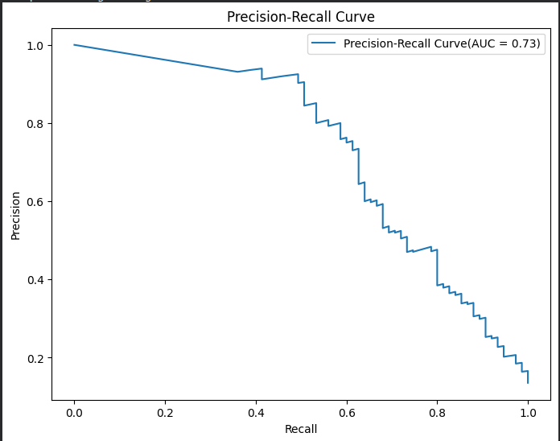

# SMS Spam Classifier  
A classifier to filter SMS by spam or non-spam  
## Dataset Description
The Dataset contains 2 columns *'Message'* and *'Label'*
- Message: Text Message
- Label: *'spam'* or *'ham'* (non-spam)  
### Tools  
|     Name      |                         Tool                         |
| :-----------: | :--------------------------------------------------: |
| **Language**  |                        Python                        |
| **Libraries** | Numpy,Pandas,Matplotlib,NLTK,Scikit-Learn,Tensorflow |

## Approach
1. Normalization - Messages are normalized. For each message - 
   - It is converted to lower case
   - Non-words are removed
   - Stopwords are removed
   - Remaining words are lemmatized using POS-tagging
2. Spam and Non-spam message lengths are computed and visualized.
3. After Normalization some messages are reduced to empty message, they are removed from dataset.
4. Vocabulary is created out of the words in the messages.
5. A CBOW model is trained to create word embeddings for the words in vocabulary. 
   - One-hot encoded vectors are created for each word in the vocabulary
   - Features and target are created
   - A neural network model is built and trained. The best model is saved.
   - The weights of first hidden layer of the best model is used to create word embeddings for the words in the vocabulary
6. Data is split into train and test
7. First 10 words from each message is selected as input for the classification.
8. Feature and Target is created from train data. For each message feature is of dimension (number_of_words x word_embedding_size) and target is binary
9. A neural network classifier is trained using the features and target.  
10. Predictions are made of test data and metrics are calculated.
11. Predictions are made for new unseen message.

## Result
1. Plotted Precision-Recall curve on test dataset
